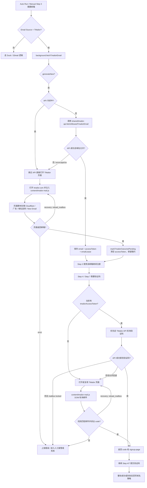
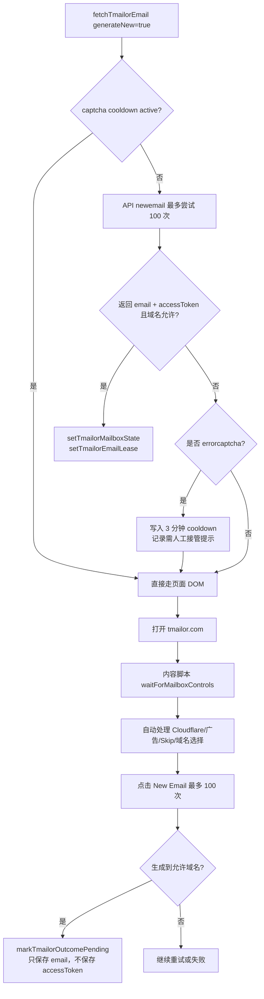
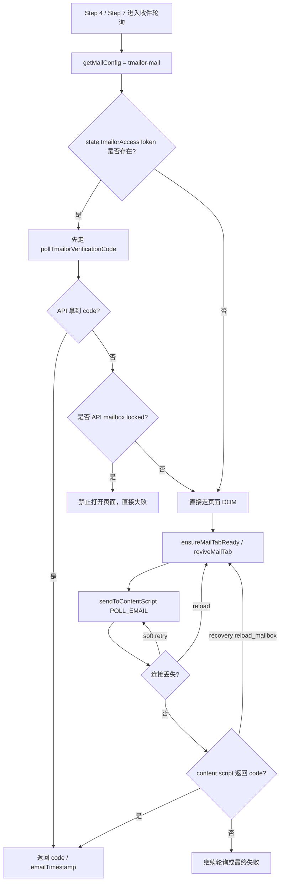

# TMailor 处理流程与逻辑图

本文档基于当前项目实现整理 TMailor 的整体处理逻辑，目标是让后续排查和维护时可以快速回答这几个问题：

- 当前这次失败发生在“取邮箱”还是“取验证码”
- 当前走的是 API 路径、页面 DOM 路径，还是 API 失败后的兜底路径
- 为什么某一轮会复用旧邮箱、锁定旧 token，或者跳过页面打开
- 哪些日志对应域名策略、人工接管、停止请求、页面 reload 恢复

## 1. 总体架构

项目里的 TMailor 不是单一模块，而是四层协作：

1. `background.js`
   负责总编排、状态持久化、步骤调度、API 与 DOM 路径选择、失败恢复、日志输出。
2. `shared/tmailor-api.js`
   负责直接访问 TMailor API，包含新邮箱生成、收件箱轮询、邮件详情读取、重试与超时处理。
3. `content/tmailor-mail.js`
   负责页面自动化，包含 Cloudflare、广告层、倒计时 Skip、刷新收件箱、打开邮件、读取验证码等逻辑。
4. `shared/tmailor-domains.js` / `shared/tmailor-mailbox-strategy.js`
   负责域名白名单/黑名单策略、成功失败反馈、API mailbox 锁定策略。

## 2. 关键状态对象

TMailor 相关核心状态主要保存在 `background.js`：

| 字段 | 作用 |
| --- | --- |
| `email` | 当前流程实际使用的邮箱 |
| `tmailorAccessToken` | API 生成邮箱后保存的 token，用于后续 API 轮询验证码 |
| `tmailorApiCaptchaCooldownUntil` | API 遇到 `errorcaptcha` 后的冷却截止时间 |
| `tmailorOutcomeRecorded` | 本轮域名结果是否已回写，避免重复记账 |
| `tmailorDomainState` | 域名策略状态，包含 `mode / whitelist / blacklist / stats` |
| `emailLease` | TMailor 租约对象，保存当前邮箱、密码、token、recoveryAttempts 等，用于跨步骤复用 |
| `tmailorApiStatus` | Side Panel 展示的 API 连通状态 |

`emailLease` 的存在很关键，它决定了“失败恢复时到底生成新邮箱，还是强制复用当前邮箱继续跑”。

## 3. 总流程图

## 4. “取邮箱”逻辑图

### 4.1 后台决策逻辑

`background.js -> fetchTmailorEmail()` 是 TMailor 入口。它的规则是：

- 生成新邮箱时，先尝试 API
- 如果 API 因 `errorcaptcha` 被 Cloudflare 拦截，就写入冷却时间
- 冷却窗口内，后续轮次不再尝试 API，直接切到页面 DOM 生成
- API 失败但不是 captcha，也会降级到页面 DOM
- 页面脚本如果要求 `reload_mailbox`，后台只负责重开 tab 再重试一次

### 4.2 页面侧关键点

`content/tmailor-mail.js -> fetchTmailorEmail()` 的页面生成逻辑里有几个真实项目特性：

- 每个等待片段都走 `sleepWithMailboxPatrol()`，不是纯 sleep
- patrol 期间会反复扫：
  - Cloudflare Turnstile
  - 全屏或插屏广告
  - 邮件详情页 `Skip xx`
  - 明确需要人工接管的阻断
- 遇到 Cloudflare 时，先尝试自动点击验证区域和 Confirm
- 如果验证后 challenge shell 还在，但邮箱输入框和按钮已经恢复，会被判定为“已清除”
- 如果当前页面邮箱和面板缓存邮箱不一致，会返回 `recovery: reload_mailbox`，要求后台重开页面

## 5. “取验证码”逻辑图

验证码轮询入口是 `background.js -> pollVerificationCodeFromMail()`，TMailor 场景下分成两种模式：

- API mailbox 模式：有 `tmailorAccessToken`
- 页面 DOM 模式：没有 token，或者 API 失败后允许回退

### 5.1 验证码轮询决策图

### 5.2 API 轮询规则

`shared/tmailor-api.js -> pollTmailorVerificationCode()` 的实际规则：

- 轮询 `listinbox`
- 用 sender / subject / targetEmail / freshness 过滤候选邮件
- 如果标题里取不到验证码，再调用 `read`
- 会跳过：
  - 不新鲜的邮件
  - 被排除的验证码
  - 读出来仍然没有 code 的邮件
- 支持 request 级重试与 poll 级重试
- 每轮 poll 前后，后台还会额外检查 auth 页有没有出现手机号验证、unsupported email 等阻断

### 5.3 DOM 轮询规则

`content/tmailor-mail.js -> handlePollEmail()` 的页面轮询特点：

- 第 1 轮先看当前是否已经在邮件详情页，如果能直接读到 code 就直接返回
- 否则读收件箱列表，按 sender / subject / targetEmail / 新鲜度选最新匹配项
- 如果列表项文本里没有 code，就打开邮件详情页继续读
- 详情页里同样会继续处理广告、Skip、Cloudflare
- 找到匹配邮件但 code 还没出现，会保留在详情页，下一次邮箱命令继续恢复

## 6. 锁定、回退和“为什么不打开页面”

这是后续最容易误判的一块。

### 6.1 API mailbox 锁定

`shared/tmailor-mailbox-strategy.js -> shouldUseTmailorApiMailboxOnly()` 规定：

- 当 mail source 是 `tmailor-mail`
- 且当前存在 `tmailorAccessToken`

就视为“当前收件箱锁定在这个 API token 上”。

这时如果 API 轮询失败，系统有两种行为：

- 普通失败：如果允许，回退到页面 DOM
- mailbox locked 场景：跳过页面打开和 DOM fallback，避免页面切换到另一个邮箱，导致验证码来源错位

对应日志一般会出现：

- `TMailor API mailbox is locked to ...`
- `Skipping page-open and DOM fallback to avoid switching to a different inbox`

### 6.2 页面生成邮箱后为什么通常没有 token

这是项目一个很重要的设计选择：

- API 生成邮箱成功后，会调用 `setTmailorMailboxState(email, accessToken)`，后续 Step 4/7 可以 API 轮询
- 页面 DOM 生成邮箱成功后，只会 `markTmailorOutcomePending(email)`，它会把 `tmailorAccessToken` 清空

原因是页面生成的新邮箱没有可靠 API token 绑定，继续强行用旧 token 去轮询，容易串箱。

## 7. 域名策略反馈

`shared/tmailor-domains.js` 负责域名准入和结果反馈。

### 7.1 准入规则

- `mode = whitelist_only`
  - 只有白名单域名允许
- `mode = com_only`
  - 白名单永远允许
  - 其余 `.com` 域名允许，但黑名单域名不允许

### 7.2 运行结果回写

`background.js -> recordTmailorOutcome()` 在整轮流程收口时回写域名结果：

- 成功：
  - 增加 success 统计
  - 若此前不在白名单，可能加入白名单
- 失败：
  - 根据错误信息判断是否应加入黑名单
  - 只记一次，受 `tmailorOutcomeRecorded` 控制

这意味着项目不是静态白名单，而是“种子列表 + 运行反馈学习”。

## 8. 租约 emailLease 的作用

`emailLease` 是 TMailor 跨步骤恢复的关键。

它至少包含：

- `source`
- `status`
- `email`
- `password`
- `accessToken`
- `invalidReason`
- `recoveryAttempts.step2/step3/step4`

作用有三类：

1. Step 3 优先复用活动租约里的邮箱，而不是盲目生成新邮箱
2. Step 4 某些恢复路径会用“当前租约邮箱”回放 Step 2-3
3. 自动运行多轮中，可以区分“这轮正在尝试修复当前邮箱”还是“应该切换新邮箱”

## 9. 停止、人工接管、reload 恢复

### 9.1 停止请求

项目里 TMailor 相关长流程基本都埋了 `throwIfStopped()`：

- `background.js -> fetchTmailorEmail`
- `shared/tmailor-api.js -> pollTmailorVerificationCode`
- `content/tmailor-mail.js -> sleepWithMailboxPatrol / handlePollEmail / Cloudflare 处理`

所以用户手动 `Stop` 后，理论上应同时中断：

- 新邮箱生成
- API 轮询
- 页面 DOM 刷新和邮件轮询

### 9.2 人工接管

以下场景会倾向于人工接管：

- Cloudflare 自动验证超时
- 广告层无法自动清掉
- 页面明确进入人工处理型阻断
- API 被 `errorcaptcha` 命中，且随后页面也未恢复

### 9.3 reload_mailbox

`recovery: reload_mailbox` 是页面脚本主动请求后台协助恢复的机制，典型触发原因：

- 页面邮箱与面板缓存邮箱不一致
- 初始 Cloudflare 处理失败
- 生成邮箱过程中 Cloudflare 自动处理失败
- 收件轮询时发现当前页面状态不适合继续

后台收到后只做一件事：

- 重开 / reload `tmailor.com`
- 等内容脚本 ready
- 将同一命令重发一次

## 10. 常见排查入口

### 10.1 “每轮开始时没刷新新邮箱”

优先看：

- `background.js -> fetchTmailorEmail()`
- 是否命中了 `tmailorApiCaptchaCooldownUntil`
- 是否当前在修复活动 `emailLease`
- 是否被 `Stop` 提前打断

### 10.2 “明明是 TMailor，为什么没打开页面”

优先看：

- 当前是否已有 `tmailorAccessToken`
- 是否触发 `shouldUseTmailorApiMailboxOnly`
- 日志里是否出现 `Skipping page-open and DOM fallback`

### 10.3 “验证码一直拿不到”

先区分：

- API 轮询失败
- 页面 DOM 轮询失败

再看：

- sender / subject / freshness 过滤是否把邮件排掉
- 当前 code 是否被排除
- 是否卡在邮件详情页广告、Skip、Cloudflare
- 是否页面已切到别的邮箱导致 `mailbox_email_mismatch`

### 10.4 “同一个域名反复失败”

优先看：

- `tmailorDomainState.mode`
- 该域名是否已进 blacklist
- `recordTmailorOutcome()` 是否已把该域名记为 blocked run

## 11. 代码定位索引

| 模块 | 关键函数 | 作用 |
| --- | --- | --- |
| `background.js` | `fetchTmailorEmail()` | TMailor 邮箱主入口，先 API 后 DOM |
| `background.js` | `pollVerificationCodeFromMail()` | Step 4/7 验证码轮询总入口 |
| `background.js` | `setTmailorMailboxState()` | 保存 API 邮箱与 token |
| `background.js` | `markTmailorOutcomePending()` | DOM 生成邮箱后记录邮箱并清空 token |
| `background.js` | `recordTmailorOutcome()` | 成功/失败后回写域名反馈 |
| `background.js` | `setTmailorEmailLease()` / `getActiveTmailorEmailLease()` | 活动租约管理 |
| `shared/tmailor-api.js` | `fetchAllowedTmailorEmail()` | API 生成允许域名邮箱 |
| `shared/tmailor-api.js` | `pollTmailorVerificationCode()` | API 轮询验证码 |
| `content/tmailor-mail.js` | `fetchTmailorEmail()` | 页面生成邮箱 |
| `content/tmailor-mail.js` | `handlePollEmail()` | 页面轮询验证码 |
| `content/tmailor-mail.js` | `runMailboxInterruptionSweep()` | 页面阻断统一巡检 |
| `content/tmailor-mail.js` | `ensureCloudflareChallengeClearedOrThrow()` | Cloudflare 自动尝试 |
| `shared/tmailor-domains.js` | `isAllowedTmailorDomain()` | 域名准入判断 |
| `shared/tmailor-domains.js` | `recordTmailorDomainSuccess()` / `recordTmailorDomainFailure()` | 域名反馈学习 |
| `shared/tmailor-mailbox-strategy.js` | `shouldUseTmailorApiMailboxOnly()` | API mailbox 锁定策略 |

## 12. 维护建议

后续如果继续改 TMailor，建议每次都检查这四个维度有没有一起更新：

1. `background.js`
   路由、状态、恢复、日志是否同步更新
2. `shared/tmailor-api.js`
   API 字段结构、错误语义、timeout/retry 是否匹配
3. `content/tmailor-mail.js`
   页面选择器、Cloudflare、广告层、详情页逻辑是否仍然可用
4. `tests`
   至少补一条“API 路径”或“DOM 路径”对应的行为测试，避免只修日志不修分支

如果后面要继续细化，可以在本文基础上再拆两份子文档：

- `docs/tmailor-mailbox-generation.md`
- `docs/tmailor-code-polling.md`

这样一份留总览，一份留深挖。
